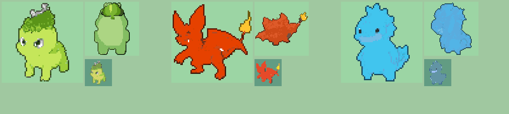
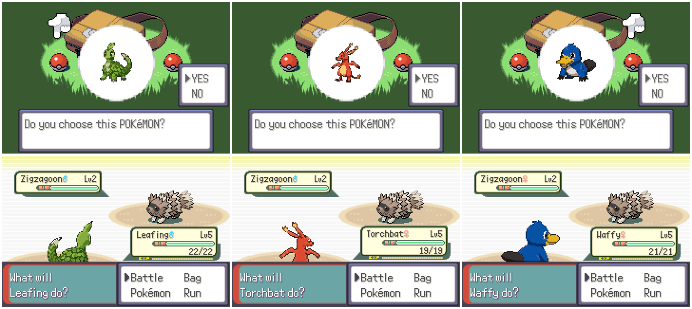

# Sprites

Sprites are drawn for the DS (Origin HeartGold), the main target, and the older GBA format
(pokeemerald-expansion) is kept below. This is how it works here.

## The DS sprites (Origin HeartGold)

| File | What | Rules |
|---|---|---|
| `front.png` | Front view (battle sprite) | 80x80, at most 15 colors + see-through |
| `back.png` | Back view | 80x80, the **same** colors as the front |
| `icon.png` | Party/PC menu icon | 32x32 |

The website's sprite studio makes them, one version per request, from the group's concept art, and
people edit and approve them there; see [STUDIO.md](STUDIO.md). The pipeline is `scripts/ds_pixel.py`
(described in [SPRITE_STYLE.md](SPRITE_STYLE.md)). Approved ones are stored in
`assets/sprites-ds/<pokemon>/` (made by `scripts/sprites.py auto`); the website shows them on the
Pokemon's page and in the **Sprites** tab. The icon and the follower sheet (the small walking
sprite, 8 frames) come from our edit LoRAs ([LORAS.md](LORAS.md)). Not made yet for any Pokemon: shiny
colors, footprint and cry.

## The GBA format (earlier target)

The rest of this page is about the earlier GBA target. The game only accepts sprites in one exact
format there. A drawing, however good, has to be converted first.

## What the game needs for each Pokemon

| File | What | Rules |
|---|---|---|
| `anim_front.png` | Front view, two animation frames stacked | 64x128, 15 colors + see-through |
| `front.png` | Front view, first frame only | 64x64, same colors |
| `back.png` | Back view (your own Pokemon in battle) | 64x64, the **same** 15 colors as the front |
| `normal.pal`, `shiny.pal` | The 15 colors, normal and shiny | 16 entries each |
| `icon.png` | Party/box icon, two frames stacked | 32x64, one of the game's 6 shared icon palettes |
| `footprint.png` | Footprint in the Pokedex | 16x16, black and white (optional) |

They live in `assets/sprites/<pokemon>/`, next to `preview.png` (everything enlarged, for
judging) and `sprite.json` (how it was made). The website shows the preview on the Pokemon's
page and in the **Sprites** tab.

The house style and its standard: [SPRITE_STYLE.md](SPRITE_STYLE.md).

## Three ways to get GBA sprites

The website no longer takes uploaded sprite pictures, and its studio only makes DS sprites; ways 1 and 2 are
kept for old requests and scripts.

**1. Upload a picture on the website (old).** On a Pokemon's page, under Images, choose what the
picture is ("Sprite: front view", "Sprite: back view", ...) and upload it. Within about 15
minutes it is converted. A finished 64x64 pixel sprite goes through untouched; a bigger
drawing is shrunk and reduced to 15 colors.

**2. Let the AI draw them (old).** `scripts/ai_sprites.py` asks an image model (Qwen-Image-2.1 in
ComfyUI, see [COMFYUI.md](COMFYUI.md)) for a front and a back view in one fixed pixel-art
style, using the Pokemon's concept art as reference, and converts the result. What the AI is
told is in [`data/sprite_prompts.yaml`](../data/sprite_prompts.yaml): one `style` for the
whole dex and a short `look` per Pokemon. These sprites are marked **AI draft**. To have one
redone, say so in the Discord (or change its `look` and run the script again).

**3. By hand on a computer with the repository:**

```bash
python scripts/sprites.py make bergflabbser --front front.png --back back.png
```

Add `--front2`, `--shiny`, `--icon`, `--footprint` for the other pictures, `--size 48` for a
Pokemon that should look smaller than a full 64 pixels, and `--grid 64` when the picture is
AI pixel art on a 64x64 grid. Sprites made this way are never replaced by the other two ways.

## What the converter does

1. Removes the background (uses the transparency if the picture has it).
2. Shrinks the drawing to fit 64x64. Pixel art that was merely enlarged is shrunk back exactly.
3. Picks 15 colors that suit front and back together, always keeping the darkest and lightest.
4. For AI pixel art (`--grid`): gives every grid cell its commonest color, removes stray
   pixels and darkens the outline.
5. Makes the icon from the front view in the best-fitting icon palette, and measures the
   sizes and offsets the game needs (`engine.front_y_offset` and friends in the species file).

Still placeholders until someone supplies them: the shiny colors, a hand-made icon, the second
animation frame, the footprint and the cry. `python scripts/sprites.py check` checks every
folder against the rules above; the automatic checks run it too.

## In the game

`scripts/export_expansion.py` writes the sprite files of every exported Pokemon into the game
code (`export/expansion/graphics.h`), and `scripts/apply_to_expansion.py` copies the files to
`graphics/pokemon/sigma/` in the game. A Pokemon without sprites keeps the question mark.
First done on 2026-10-03 with the three starters; this is what the game's own tools decode
from the built graphics (front, back, icon):



And this is the ROM itself, on the starter choice and in the first battle (2026-10-03):



The three Pokemon under `starters` in `data/config.yaml` replace Treecko, Torchic and Mudkip
in Professor Birch's bag once all three are in the game. Still missing for every Pokemon:
shiny colors, a second animation frame, footprint, cry and the small overworld sprite.
