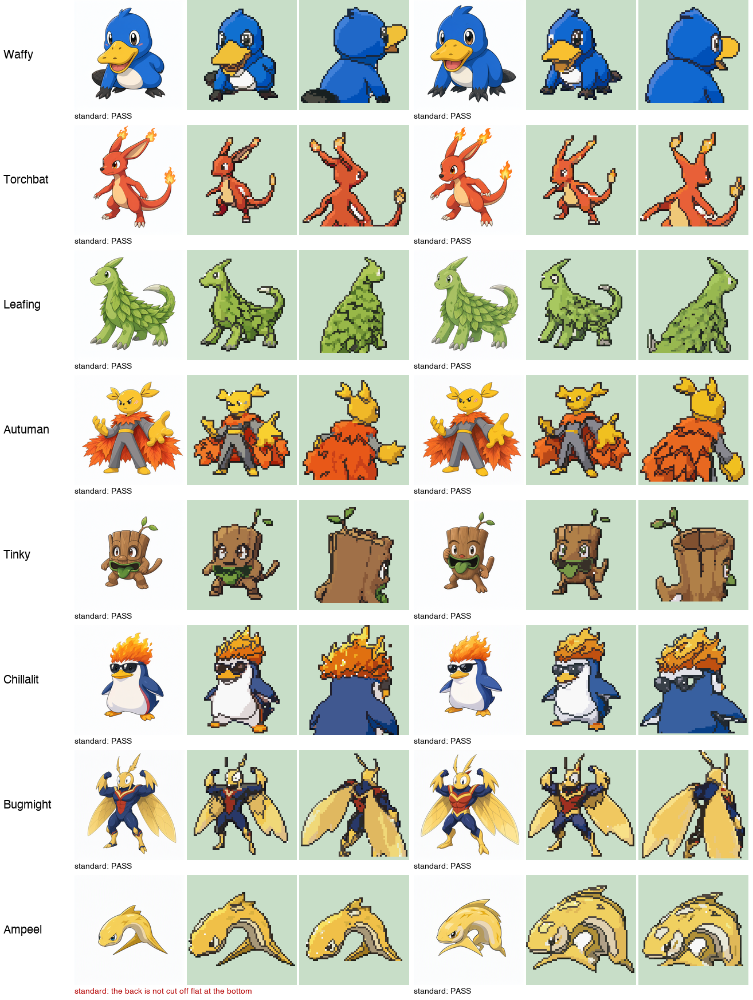
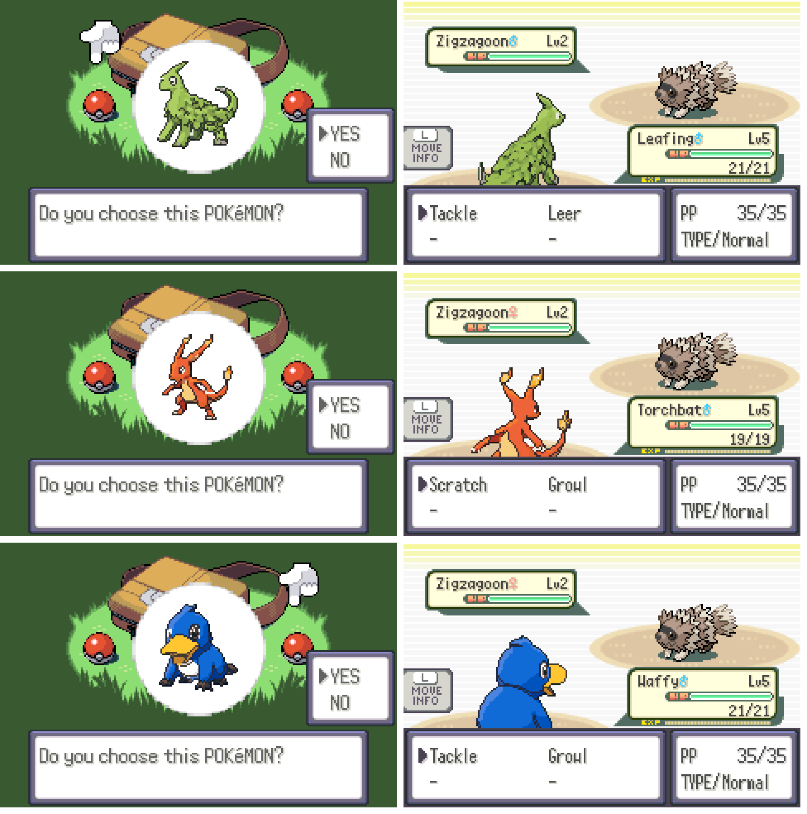

# The Sigma sprite style

Every Sigma Pokemon's battle sprites are made the same way, so the whole dex has one look and
anyone can make the next one. This page says what the standard is, how the sprites are made,
and how a sprite is checked. In the sprite studio on the website this is the style
"Sigma sprite style" (`sprite-official`), and it is the default.



Eight Pokemon with very different designs, two attempts each: the artwork Qwen drew, then the
front and back sprites built from it. 15 of the 16 pass every check; Ampeel's first back fails
(Qwen drew the eel from the side, not from behind), so the studio would put it last. In the
game, next to the game's own Zigzagoon:



## The standard

The standard is what the games' own sprites do, measured: the 844 front sprites and 843
front/back pairs in pokeemerald-expansion's graphics were measured on 2026-10-03 (locally, for
the numbers only; no Nintendo picture is in this repository). Ours must fall in the range that
95% of theirs fall in. A typical official sprite, and ours (median of eight test Pokemon):

| | games' sprites (5% / median / 95%) | ours |
|---|---|---|
| colours | 10 / 13 / 15 | 15 |
| outline brightness (0 black, 255 white) | 23 / 44 / 73 | 48 |
| share of the outline that is black | 0.28 / 0.54 / 0.84 | 0.61 |
| inner lines (share of the inside) | 0.05 / 0.11 / 0.18 | 0.05 |
| single-pixel texture | 0.06 / 0.10 / 0.17 | 0.04 |
| shades per colour | 2.0 / 2.8 / 4.7 | 3.0 |

Ours have a little less single-pixel texture and fewer inner lines than the games: shades come
in clusters on purpose, because scattered shade pixels and lines where a shadow starts read as
mess on our sprites (the group's verdict, 2026-10-03).

What that means for a sprite:

- **Frame:** 64 x 64 pixels; front and back share one palette of at most 15 colours.
- **Size:** first stages about 54 pixels, middle stages 60, final stages 63 (from the base stat
  total; `sprite_pixels` in `scripts/sprite_worker.py`). The games' median is 53.
- **Front:** three-quarter view turned to the left, the whole body, an expressive battle pose.
- **Back:** seen over the shoulder, drawn closer than the front and cut off flat at the bottom.
- **Outline:** closed and dark, but coloured: each part's own darkest tone, nearly black only on
  the shadow side at the bottom right. Lines between parts and inner lines (creases, mouths) are
  dark tones of the part, not black.
- **Shading:** four tones per part (shadow, base, light, a rare highlight), shadows a little
  cooler and lights warmer. Light comes from the upper left across the whole part, and shade
  comes in clusters, not in scattered pixels.
- **Face:** every eye has a dark pupil and a light glint.

`standards()` in `scripts/sprite_quality.py` checks these. 77% of the games' own sprites pass it
(the rest are mostly eyeless or floating designs); an attempt of ours that fails it goes to the
back of the queue and says why.

## How a sprite is made

1. **Official-style artwork.** Qwen-Image redraws the group's concept art (up to three
   reference pictures) as official Pokemon artwork: clean thin outlines, flat cel shading, and
   sprite proportions - a head about 40% of the height with a big, clear face - because a face
   needs pixels: at normal proportions a head is 12 pixels wide and brows and mouth drop out. Then it
   draws the same creature from behind, using its new front picture as the reference, so front
   and back match. Prompts: `official_front`, `official_back` and `official_poses` in
   `data/sprite_prompts.yaml`.
2. **Built pixel by pixel.** `scripts/pixel_render.py` does not shrink the artwork (that turns
   lines and faces to mud). It works in seven fixed steps, each with one job, and all its numbers
   are in one place (`STYLE` and `RAMP` at the top of the file, each with where it comes from):
   1. *segment* the artwork into silhouette, ink (dark and thin) and parts. A part is one colour
      in all its light and shadow (grouped by hue and colourfulness; greys by their lightness),
      so light and shadow of one colour never get a line between them. Wide dark areas such as
      black claws or sunglasses are parts, not ink; likewise a light area thinner than half a
      sprite pixel (rim light, shine) is lighting, not a part.
   2. *sample* it onto the sprite grid: part, lightness and ink for every pixel.
   3. *shape*: fill notches, remove spurs, round doubled corners (the pixel-perfect rule),
      let specks of a part join their surroundings.
   4. *face*: each eye is redrawn from the artwork: the eye white with the iris and pupil inside
      it, and the glint the artwork has. Rules that keep it from ever drawing a false eye: an eye
      has a pupil (a white without one is a horn or a tooth); a dark blob is an eye only if the
      artwork has a glint in it (else it is a tail, a claw or a marking); glints are never
      invented. Brows and mouths are kept as face lines. Only in the upper part of the creature.
   5. *tones*: every pixel takes the tone of its part (shadow, base, light, highlight, line or
      outline) nearest to what the artwork shows there; where a dark stroke runs through a pixel
      the stroke wins. The artwork's detail decides, the ramps keep it clean.
   6. *lines*: coloured outline (darkest on the shadow side), lines between parts that differ,
      and the artwork's inner lines (scales, wood grain, creases) traced as clean one-pixel lines:
      every ink stroke is thinned to its middle line and laid on the grid, without doubled corners.
   7. *palette*: the renderer fits every part's ramp into 15 colours itself, and the back uses
      exactly the front's colours.
   If the drawn creature comes out smaller than asked (thin tips drop out), it is drawn once
   more at the size that makes it fit. The icon (32 x 32) is built the same way.
3. **Checked.** `standards()` in `scripts/sprite_quality.py` measures each attempt against the
   standard above. The worker makes twice as many attempts as asked for and hands in the better half;
   an attempt that misses the standard goes to the back and says why in its notes.
4. **People choose.** The checks find technical faults, not a wrong design. The group picks the
   attempt that looks like their Pokemon, or comments on it for a redo.

The same request always gives the same sprites (the seeds come from the request number, and the
renderer is not random).

## The test set

`tests/sprite_style/` holds artwork for eight very different Pokemon (two attempts each, front
and back) and the sprites accepted for them. After any change to the renderer:

```bash
python scripts/check_sprite_style.py
```

It renders all 16, says which changed and by how many pixels, checks each against the standard,
and writes a sheet (art, front, back, reference) to `tests/sprite_style/sheet.png`. If the change
is wanted, `--update` makes the new sprites the reference. On 2026-10-03: 14 of 16 pass; both
Ampeels fail on the eye (its eye in the artwork is a tiny blue dot), one also on its back (drawn
from the side).

## Making one by hand

The studio does all of this. To build a sprite from a picture yourself:

```bash
python scripts/pixel_render.py art.png front.png --size 54
```

```bash
python scripts/pixel_render.py art_back.png back.png --size 54 --back --palette-from front.png
```

```bash
python scripts/sprites.py make waffy --front front.png --back back.png
```

## What helps

- Clear concept art: a front view, and if possible a back view and an action pose (like the
  character sheets for Leafing and Torchbat). Pictures with a lot of text work, but the creature
  should be big in them.
- A short look on the Pokemon's page (colours and the 2-3 things that must be there).
- The pose choice in the studio, for creatures whose personality shows in a pose.

## Tried and dropped (2026-10-03)

Shrinking an illustration (with or without PixelOE), having the AI "clean up" a shrunk sprite,
the Pokemon sprite LoRAs (Emerald and Sprite XL, also with an IP-Adapter), and a free redesign
by the AI. They gave muddy faces, lost the group's design, or both. Comparison pictures are in
[STUDIO.md](STUDIO.md).
