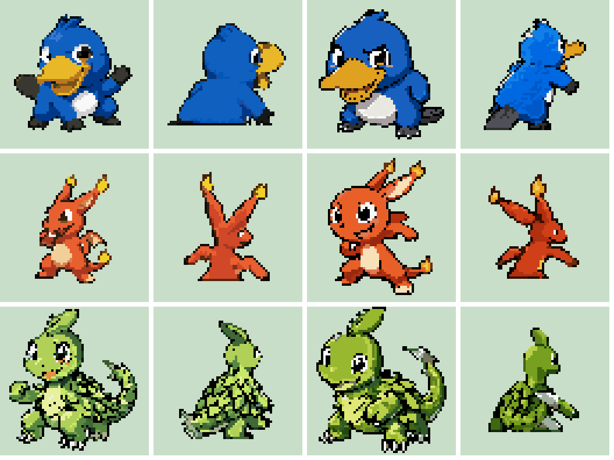
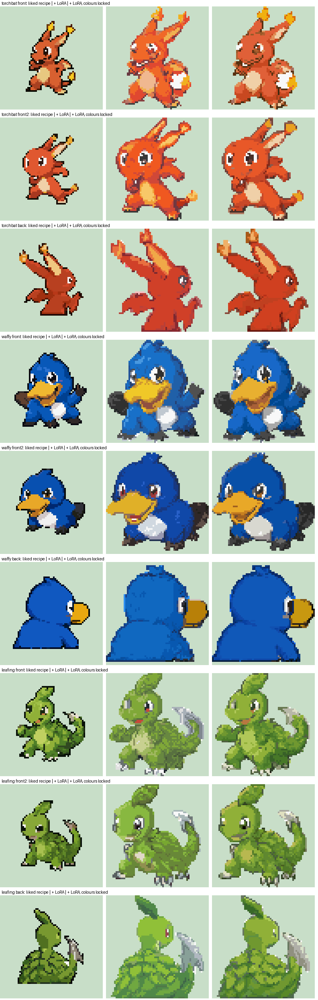
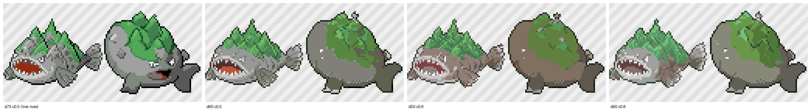

# The sprite studio

On every Pokemon's page on the website there is a **Sprite studio**: ask the AI for sprites,
look at the attempts, comment on them, have them redone and approve one. Nobody needs
anything but the website.

## How to use it (since 2026-10-05)

Open a Pokemon and press the **Sprite** tab.

1. **Pick the pictures the AI should follow** - tap up to three of the Pokemon's pictures; the
   first one matters most. (Add concept art under **Pictures** first if there is none.)
2. **Make a sprite.** The request joins one line shared by everybody; the studio shows the line,
   what the drawing PC is doing right now ("front sprite 2 of 3") and where your request is. One
   sprite is drawn at a time: front and back (80x80) and the menu icon (32x32), in the DS style
   ([the approved pipeline](SPRITE_STYLE.md), `scripts/ds_pixel.py`). A new sprite takes about
   5 to 10 minutes. The menu icon comes from our icon edit LoRA ([LORAS.md](LORAS.md)). `ds_pixel.make` also draws a follower
   walking sheet when the follower LoRA is on the PC, but the studio does not hand that in or show it yet.
3. **Pick a version and make it perfect.** Every version is shown in a row; tap one to open it in
   the editor:
   - **Draw on it yourself**: pencil, eraser, fill, recolour (every pixel of one colour at once),
     pick a colour, undo/redo, a pixel grid. The game allows 15 colours per picture; the editor
     counts them. **Save my drawing** makes it a new version.
   - **Ask the AI**: write what should change and choose front, back or both - or press
     **Mark area**, drag a box, and only that part is changed (everything outside the box stays
     exactly the same, pixel for pixel). Takes 1 to 2 minutes. The result is a new version.
   - **Approve** the one you like (or **Reject**). The approved one becomes the Pokemon's DS
     sprite within about 15 minutes (`assets/sprites-ds/<pokemon>/`, made by `scripts/sprites.py
     auto` from the pictures captioned `[ds-front]`, `[ds-back]`, `[ds-icon]`).

How the AI change works: Qwen-Image-Edit is shown the finished pixel sprite (blown up on its
grid, plus a copy with a red frame for an area) and asked for the change; its picture is read back
on the sprite's own grid (`ds_pixel.edit`). For an area, only the cells inside the box are taken.
Two attempts are drawn and the cleaner one is kept. Colours are kept at 15 at most by merging the
rarest new colour into its nearest.

Versions drawn by hand are saved by the edge function `sprite-draw` (no key; it accepts only
80x80 / 64x64 / 32x32 PNGs, at most 200 per hour). Older 64x64 attempts (GBA styles) are still
listed under "older attempts".

Database (migration `supabase/migrations/2026-10-05_studio_v2.sql`): `sprite_jobs.mode` (`new` or
`edit`), `view`, `area`; `sprite_candidates.gen` (4 = DS), `kind` (`ai`, `edit`, `drawn`),
`parent_id`, `note`, `editor`, `icon`; RPC `request_sprite_edit`. Edge functions are in
`supabase/functions/`.

## The styles (retired)

Since 2026-10-05 the website only asks for DS sprites (style `ds`, above). The worker still knows the
older GBA styles below, for scripts and old requests, but none of them is used for new sprites any more.
The Sprite XL and Emerald styles need the models listed (as no longer used) in [COMFYUI.md](COMFYUI.md).

- **Sigma sprite style (`sprite-official`, GBA 64x64, the default 2026-10-03 to 2026-10-05).** Qwen
  draws the concept art as official-style Pokemon artwork, and `scripts/pixel_render.py` builds
  the sprite from it pixel by pixel; every attempt is checked against the sprite standard. What
  the standard is and how it works: [SPRITE_STYLE.md](SPRITE_STYLE.md). Its renderer still makes the rough draft
  whose silhouette guides the DS pipeline.
- **Redesigned with more character (`sprite-clean`).** Most
  concept art is a plain drawing without pose or expression, and shrinking it loses the face.
  So: (1) Qwen *redraws* the first reference picture with freedom - bigger head and eyes, a
  face with attitude, a dynamic pose (`redesign_front` / `redesign_back` in
  `data/sprite_prompts.yaml`; telling it to "keep the design exactly" makes it copy the
  reference instead); (2) that is shrunk to a rough sprite at official size, as below;
  (3) Qwen repaints the rough sprite at exactly its size and place (`cleanup`); (4) that is
  snapped to the 64 grid. Results vary a lot between attempts. Test on the starters (front and back, two
  attempts each):
  
  Tried and worse: a cleanup that is told to stay pixel art (cleaner but lifeless), and the
  Sprite XL LoRA on top of this (softer and muddier):
  
- **Close to the concept art (`sprite-xl`).** Two steps: Qwen-Image-2.1 draws a clean
  illustration of the creature in the chosen pose from the concept art; then NoobAI-XL with
  the [Pokemon Sprite XL PixelArt LoRA](https://civitai.com/models/378602) repaints it as a
  Pokemon sprite while a ControlNet holds its outlines in place.
  The illustration is drawn in the angles the games use (front: three-quarter view turned
  left; back: over the shoulder, facing up and right), the creature is drawn at the size
  official sprites of its strength have (first stages about 40 pixels, final stages fill the
  frame). The back view is drawn 1.4 times closer and only its upper part is kept, cut off
  flat at the bottom, as the games do. The attempts of one request alternate between two ways of finishing, because each
  wins on some creatures: **drawn** (the illustration is shrunk with a method that keeps thin
  outlines, eyes and claws alive - PixelOE) and **repainted** (the sprite LoRA repaints it and
  the colors are then locked to the illustration).
  How freely it repaints is a trade-off (`denoise` and `control` in `SPRITE_XL`): more freedom
  looks more like Pokemon but drifts toward grey and invents things, less keeps the colors and
  the design. Set to 0.55 / 0.6 after this test on 2026-10-02 (d = denoise, c = control):
  
- **Plain pixel art.** Qwen draws the sprite as pixel art directly. Keeps the most detail of
  the design, but looks less like Pokemon.

Tried and dropped on 2026-10-02: the "Pokemon Emerald Sprite Style" LoRA (civitai 1523016).
It only looked like Gen 3 when it was free to redesign the creature
(). The worker still understands the styles
`emerald-light` and `emerald-medium`, but the website no longer offers them.

The Sprite XL and Emerald LoRAs were trained on official Pokemon sprites. Whether such models may be used is
legally unsettled; Arvind decided to use them (2026-10-02).

## What is fixed and what is free

The goal: the same request must always give the same result, and all sprites must look like
they belong to one game - without every Pokemon coming out the same.

| Fixed (the same for every sprite) | Where |
|---|---|
| The DS style text and the prompts for the front, back and edits | `STYLE`, `FRONT`, `BACK` in `scripts/ds_pixel.py` |
| The artwork prompts (Diamond/Pearl-era official artwork, front and back) | `official_front_gen4`, `official_back_gen4` in `data/sprite_prompts.yaml` |
| The sizes per stage, the 96 grid and the 15 colours | `scripts/sprite_worker.py` (`GAMES`), `scripts/ds_pixel.py` |
| The icon and follower LoRAs | `ICON_LORA`, `FOLLOWER_LORA` in `scripts/ds_pixel.py`, see [LORAS.md](LORAS.md) |
| The model, its settings and the conversion | `scripts/comfy.py`, `scripts/sprites.py` |
| The seeds of a request: request number x 100, plus 5, 6, 7 for the three fronts (+1, +2 for edits) | `scripts/sprite_worker.py`, `scripts/ds_pixel.py` |

| Free (decided per Pokemon by people) | Where |
|---|---|
| The look and the pose (`look`, `ds_pose`, `signature`) | `data/sprite_prompts.yaml` |
| Which concept art the AI sees | ticked in the studio |
| What to change, and on which spot | "Ask the AI" and the marked area, or the pixel editor |
| Which version wins | Approve |

Every version stores its prompt and seed, so it can be reproduced. To
change the style of the whole dex, change the prompts above: sprites
drawn after that use the new style; approved ones stay as they are until redone.

## How it works

```
website --request--> database (queue) <--asks for work-- worker on the PC with the GPU
website <--attempts-- database + file storage <--hands in sprites-- worker
approved attempt --> attached to the Pokemon as sprite pictures --> dex (within 15 minutes)
```

The worker (`scripts/sprite_worker.py`) only makes outgoing connections; the PC is not
reachable from the internet. It starts ComfyUI when it needs it and gives the graphics
memory back after three minutes without work. See [COMFYUI.md](COMFYUI.md) for the PC.

### The worker on the PC

Installed on 2026-10-02 on Arvind's Legion:

| What | Where |
|---|---|
| A copy of this repository with its own Python | `D:\LocalAI\sigma-dex` |
| The worker key (lets the worker hand in sprites; not in the repository) | `D:\LocalAI\sigma-worker\worker.key` |
| Start script and log | `D:\LocalAI\sigma-worker\run_worker.bat`, `worker.log` |
| Starts at Windows login | shortcut `sigma-sprite-worker.bat` in the Startup folder (`shell:startup`) |

The worker updates its copy of the repository by itself (`git pull`) and restarts when
something changed, so whoever can push to the repository decides what runs on that PC.
To stop it: delete the Startup shortcut and end the `python` process running
`sprite_worker.py` in Task Manager.

Limits: 40 requests waiting at once, 120 requests and 300 comments per hour.
