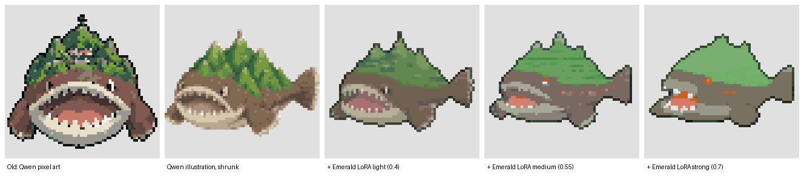

# The sprite studio

On every Pokemon's page on the website there is a **Sprite studio**: ask the AI for sprites,
look at the attempts, comment on them, have them redone and approve one. Nobody needs
anything but the website.

## How to use it

1. Attach the Pokemon's concept art under **Images** (if it is not there yet).
2. In the studio, write the **look**: what to keep and exaggerate at sprite size. A sprite is
   64 pixels, so "three chunky mountain peaks" works and "seven detailed mountains" does not.
3. Tick the pictures the AI should look at, choose the **pose** of the front view, the
   **style** (see below) and how many attempts, then press **Draw sprites**.
   Each attempt takes about a minute and appears by itself.
4. Judge the attempts:
   - **Click a spot** on a sprite to pin a comment there ("bigger eyes").
   - **Comment** on the whole sprite in the box below it.
   - **Redo with comments** draws that attempt again with every comment on it as an
     instruction; only the views that were commented on are redrawn.
   - **Reject** the ones that are not good enough, **Approve** the one that is.
5. The approved one becomes the Pokemon's sprite within about 15 minutes. Approving another
   one later replaces it.

The **Sprites** tab lists everything that is waiting for a verdict.

## The two styles

- **Pokemon sprite style (recommended).** Two steps: Qwen-Image-2.1 draws a clean
  illustration of the creature in the chosen pose from the concept art; then NoobAI-XL with
  the [Pokemon Sprite XL PixelArt LoRA](https://civitai.com/models/378602) repaints it as a
  Pokemon sprite while a ControlNet holds its outlines in place. This is the one that looks
  like a real Pokemon game.
- **Plain pixel art.** Qwen draws the sprite as pixel art directly. Keeps the most detail of
  the design, but looks less like Pokemon.

Tried and dropped on 2026-10-02: the "Pokemon Emerald Sprite Style" LoRA (civitai 1523016).
It only looked like Gen 3 when it was free to redesign the creature
(). The worker still understands the styles
`emerald-light` and `emerald-medium`, but the website no longer offers them.

Both LoRAs were trained on official Pokemon sprites. Whether such models may be used is
legally unsettled; Arvind decided to use them (2026-10-02).

## What is fixed and what is free

The goal: the same request must always give the same result, and all sprites must look like
they belong to one game - without every Pokemon coming out the same.

| Fixed (the same for every sprite) | Where |
|---|---|
| The style text: pixel grid, outline, shading, number of colors, lighting | `style` in `data/sprite_prompts.yaml` |
| The poses to choose from, and how the back view is asked for | `poses` and `back` in the same file |
| The sprite step: its model, LoRA and strengths | `SPRITE_XL` in `scripts/sprite_worker.py`, `restyle` in `scripts/comfy.py` |
| The model, its settings (25 steps, 1024x1024) and the conversion to 64x64 / 15 colors | `scripts/comfy.py`, `scripts/sprites.py` |
| The seed of each attempt: request number x 100 + attempt number | `scripts/sprite_worker.py` |

| Free (decided per Pokemon by people) | Where |
|---|---|
| The look | typed in the studio |
| Which concept art the AI sees | ticked in the studio |
| The pose and the style | chosen in the studio |
| How many attempts to choose between | chosen in the studio |
| What to change, on which spot | comments |
| Which attempt wins | Approve |

Every attempt stores its full prompt, seed and style version, so it can be reproduced. To
change the style of the whole dex, change `style` in `data/sprite_prompts.yaml`: sprites
drawn after that use the new style; approved ones stay as they are until redone.

## How it works

```
website --request--> database (queue) <--asks for work-- worker on the PC with the GPU
website <--attempts-- database + file storage <--hands in sprites-- worker
approved attempt --> attached to the Pokemon as sprite pictures --> dex (within 15 minutes)
```

The worker (`scripts/sprite_worker.py`) only makes outgoing connections; the PC is not
reachable from the internet. It starts ComfyUI when it needs it and gives the graphics
memory back after three minutes without work. See [COMFYUI.md](COMFYUI.md) for the PC.

### The worker on the PC

Installed on 2026-10-02 on Arvind's Legion:

| What | Where |
|---|---|
| A copy of this repository with its own Python | `D:\LocalAI\sigma-dex` |
| The worker key (lets the worker hand in sprites; not in the repository) | `D:\LocalAI\sigma-worker\worker.key` |
| Start script and log | `D:\LocalAI\sigma-worker\run_worker.bat`, `worker.log` |
| Starts at Windows login | shortcut `sigma-sprite-worker.bat` in the Startup folder (`shell:startup`) |

The worker updates its copy of the repository by itself (`git pull`) and restarts when
something changed, so whoever can push to the repository decides what runs on that PC.
To stop it: delete the Startup shortcut and end the `python` process running
`sprite_worker.py` in Task Manager.

Limits: 40 requests waiting at once, 120 requests and 300 comments per hour.
